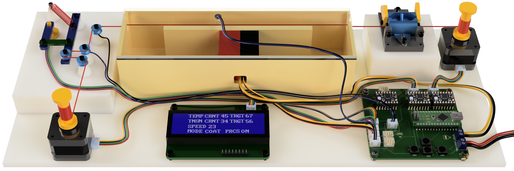

# ThreadCoatingFactory_Firmware
[Research Paper Link](https://github.com/egeozgul/ThreadCoatingFactory_Firmware/blob/main/Thread_Coating_Factory_Paper.pdf
)

[Project Page Link](https://egeozgul.com/filament-coating-factory/)

This is a customlab equipment designed for Nanolab at Tufts University which automates parametric conductive thread manufacturing process. This device allows researchers and graduate students at Nanolab to produce high quality sensing threads for wearable electronics research projects.

